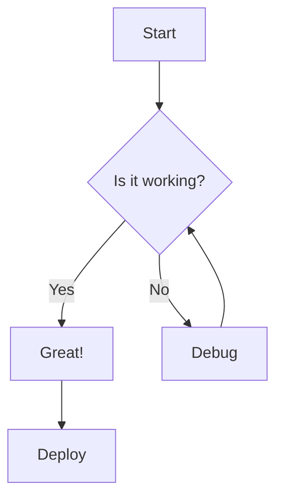
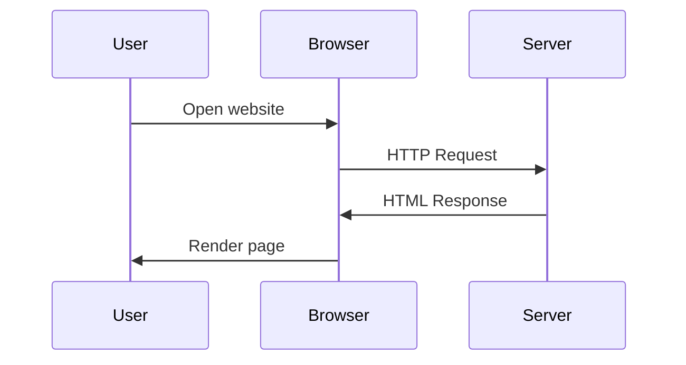

This is a comprehensive test article to verify all markdown formatting features are working correctly. It includes examples of every supported markdown element.

<!--more-->

## Headings

All heading levels are supported and will be auto-linked:

### Level 3 Heading
#### Level 4 Heading
##### Level 5 Heading
###### Level 6 Heading

## Text Formatting

**Bold text** and __also bold__.

*Italic text* and _also italic_.

***Bold and italic*** and ___also bold and italic___.

~~Strikethrough text~~

Inline `code snippets` work great.

## Links and References

[Standard link](https://tylerbutler.com)

[Link with title](https://tylerbutler.com "Tyler Butler's Website")

<https://tylerbutler.com> - automatic link

Internal link: [About page](/about/)

Reference-style links[^1] with footnotes.

## Lists

### Unordered Lists

- First item
- Second item
  - Nested item 1
  - Nested item 2
    - Deeply nested item
- Third item
  - Another nested item

### Ordered Lists

1. First item
2. Second item
   1. Nested item
   2. Another nested
3. Third item

### Task Lists

- [x] Completed task
- [ ] Incomplete task
- [x] Another completed task
  - [ ] Nested incomplete
  - [x] Nested complete

## Blockquotes

> This is a simple blockquote.
> It can span multiple lines.

> **Note**
> This is a GitHub-style note alert.

> **Warning**
> This is a GitHub-style warning alert.

> **Important**
> This is a GitHub-style important alert.

> Nested blockquotes:
> > This is nested
> > > And this is deeply nested

## Code Blocks

### Basic Code Block

```
Plain text code block
No syntax highlighting
```

### JavaScript with Line Numbers

```js showLineNumbers
// JavaScript with automatic line numbers
function fibonacci(n) {
  if (n <= 1) return n;
  return fibonacci(n - 1) + fibonacci(n - 2);
}

const result = fibonacci(10);
console.log(`Fibonacci(10) = ${result}`);
```

### TypeScript with Line Numbers

```ts
// TypeScript with automatic line numbers
interface User {
  id: number;
  name: string;
  email: string;
}

function greetUser(user: User): string {
  return `Hello, ${user.name}!`;
}

const user: User = {
  id: 1,
  name: "Tyler",
  email: "test@example.com"
};
```

### Python with Line Numbers

```python
# Python with automatic line numbers
def quicksort(arr):
    if len(arr) <= 1:
        return arr
    pivot = arr[len(arr) // 2]
    left = [x for x in arr if x < pivot]
    middle = [x for x in arr if x == pivot]
    right = [x for x in arr if x > pivot]
    return quicksort(left) + middle + quicksort(right)

numbers = [3, 6, 8, 10, 1, 2, 1]
sorted_numbers = quicksort(numbers)
print(sorted_numbers)
```

### Rust with Line Numbers

```rust
// Rust with automatic line numbers
fn factorial(n: u64) -> u64 {
    match n {
        0 => 1,
        _ => n * factorial(n - 1),
    }
}

fn main() {
    let num = 5;
    println!("Factorial of {} is {}", num, factorial(num));
}
```

### C# with Line Numbers

```csharp
// C# with automatic line numbers
using System;
using System.Linq;

public class Program
{
    public static void Main()
    {
        var numbers = Enumerable.Range(1, 10);
        var evens = numbers.Where(n => n % 2 == 0);

        Console.WriteLine("Even numbers: " + string.Join(", ", evens));
    }
}
```

### HTML with Line Numbers

```html
<!DOCTYPE html>
<html lang="en">
<head>
  <meta charset="UTF-8">
  <meta name="viewport" content="width=device-width, initial-scale=1.0">
  <title>Test Page</title>
</head>
<body>
  <h1>Hello World</h1>
  <p>This is a test page.</p>
</body>
</html>
```

### CSS

```css
/* CSS without line numbers */
:root {
  --primary-color: #a2834e;
  --background-color: #f7f6f5;
  --text-color: #262626;
}

.container {
  max-width: 636px;
  margin: 0 auto;
  padding: 2rem;
}

.heading {
  font-family: 'Advent Pro', sans-serif;
  color: var(--primary-color);
}
```

### JSON

```json
{
  "name": "test-package",
  "version": "1.0.0",
  "dependencies": {
    "astro": "^5.13.0",
    "typescript": "^5.0.0"
  },
  "scripts": {
    "dev": "astro dev",
    "build": "astro build"
  }
}
```

### Shell/Bash

```bash
#!/bin/bash

# Build and deploy script
echo "Building site..."
npm run build

echo "Running tests..."
npm test

if [ $? -eq 0 ]; then
  echo "Deploying to production..."
  netlify deploy --prod
else
  echo "Tests failed, aborting deployment"
  exit 1
fi
```

### SQL

```sql
-- Create users table
CREATE TABLE users (
  id SERIAL PRIMARY KEY,
  name VARCHAR(100) NOT NULL,
  email VARCHAR(255) UNIQUE NOT NULL,
  created_at TIMESTAMP DEFAULT CURRENT_TIMESTAMP
);

-- Insert sample data
INSERT INTO users (name, email)
VALUES
  ('Tyler Butler', 'tyler@example.com'),
  ('Jane Doe', 'jane@example.com');

-- Query users
SELECT id, name, email
FROM users
WHERE created_at > NOW() - INTERVAL '7 days'
ORDER BY created_at DESC;
```

## Tables

### Basic Table

| Feature | Supported | Notes |
|---------|-----------|-------|
| Markdown | ✅ | Full GFM support |
| Code Blocks | ✅ | Expressive Code |
| Tables | ✅ | GitHub-style |
| Footnotes | ✅ | Custom plugin |

### Alignment Table

| Left | Center | Right |
|:-----|:------:|------:|
| Left aligned | Center aligned | Right aligned |
| Text | More text | Numbers: 123 |
| A | B | C |

## Horizontal Rules

Three different syntaxes:

---

***

___

## Images


## Inline HTML

You can use <strong>inline HTML</strong> within markdown.

<div style="border: 2px solid #a2834e; padding: 1rem; margin: 1rem 0;">
  This is a custom HTML block with styling.
</div>

## Special Characters

Smart quotes: "double" and 'single'

Em dash — and en dash –

Ellipsis...

Arrows: → ← ↑ ↓

Copyright © Trademark ™ Registered ®

## Mermaid Diagrams

<!-- TODO: Re-enable once mermaid SVG generation is fixed on Netlify -->
<!--



-->

## Definition Lists (if supported)

Term 1
: Definition 1a
: Definition 1b

Term 2
: Definition 2

## Abbreviations

The HTML specification is maintained by the W3C.

*[HTML]: Hyper Text Markup Language
*[W3C]: World Wide Web Consortium

## Line Breaks

Use two spaces at the end of a line
to create a line break without a new paragraph.

Or use a backslash\
at the end of the line.

Or use `<br/>` tags.<br/>
Like this.

## Escaping

You can escape special characters:

\* Not a list item

\# Not a heading

\[Not a link\](url)

## Combining Features

> **Code in blockquotes:**
>
> ```js
> const message = "Hello from a code block in a blockquote!";
> console.log(message);
> ```

**Lists with code:**

1. First item with `inline code`
2. Second item with a code block:
   ```python
   def example():
       return "code in list"
   ```
3. Third item

**Table with code:**

| Language | Example |
|----------|---------|
| JavaScript | `const x = 42;` |
| Python | `x = 42` |
| Rust | `let x: i32 = 42;` |

## Footnotes Section

This text has a footnote reference[^2].

Multiple footnotes[^3] can be used[^4] in the same paragraph.

[^1]: This is the first footnote with a reference-style link.
[^2]: This is the second footnote with **bold text** and *italic text*.
[^3]: Footnotes can contain multiple paragraphs.

    Like this one with indented content.

    And even code: `const x = 42;`

[^4]: The fourth footnote with a [link](https://tylerbutler.com).

## Summary

This test article includes:

- ✅ All heading levels (2-6)
- ✅ Text formatting (bold, italic, strikethrough, code)
- ✅ Links (inline, reference, automatic)
- ✅ Lists (ordered, unordered, task, nested)
- ✅ Blockquotes (simple, nested, GitHub alerts)
- ✅ Code blocks (10+ languages with various features)
- ✅ Tables (basic and aligned)
- ✅ Horizontal rules
- ✅ Images
- ✅ Inline HTML
- ✅ Special characters and typography
- ✅ Mermaid diagrams
- ✅ Footnotes
- ✅ Combined features

Use this article to verify HTML output and styling consistency.
