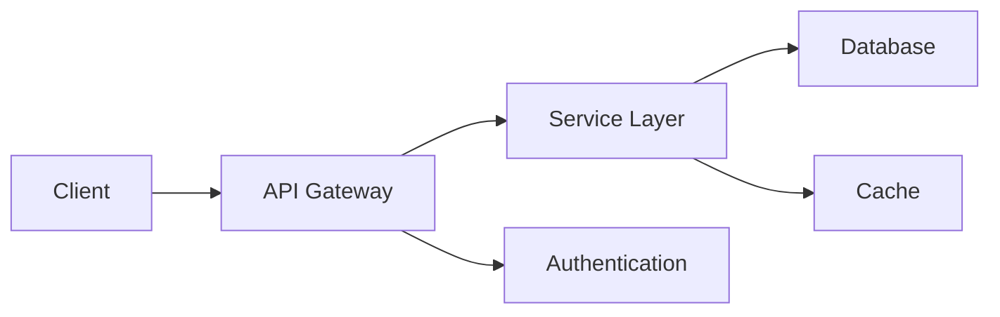
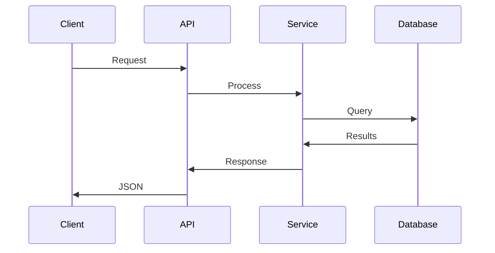
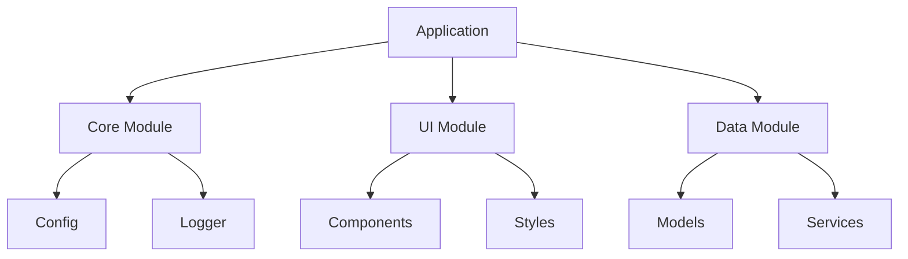

## Overview

This is a comprehensive test project to verify all markdown formatting features work correctly on project pages. It demonstrates every supported markdown element to ensure consistent rendering and styling.

## Features

### Text Formatting

This project supports **bold text**, *italic text*, ***bold and italic***, ~~strikethrough~~, and `inline code`.

Smart typography includes "double quotes", 'single quotes', em dashes—like this—and ellipsis...

### Headings Hierarchy

#### Level 4: Installation
##### Level 5: Prerequisites
###### Level 6: System Requirements

All headings are automatically linked for easy navigation.

## Installation

### Using npm

```bash
# Clone the repository
git clone https://github.com/test/markdown-test.git
cd markdown-test

# Install dependencies
npm install

# Run development server
npm run dev
```

### Using Docker

```dockerfile
FROM node:24-alpine

WORKDIR /app

COPY package*.json ./
RUN npm ci --only=production

COPY . .

EXPOSE 4321
CMD ["npm", "start"]
```

### Manual Setup

1. Download the latest release
2. Extract to your desired directory
3. Configure environment variables:
   ```bash
   cp .env.example .env
   ```
4. Run the application

## Architecture

### System Design

<!-- TODO: Re-enable once mermaid SVG generation is fixed on Netlify -->
<!--

-->

### Data Flow

<!--

-->

### Component Architecture

<!--

-->

## Configuration

### Environment Variables

| Variable | Description | Default | Required |
|----------|-------------|---------|----------|
| `PORT` | Server port | `4321` | No |
| `DATABASE_URL` | Database connection | - | Yes |
| `API_KEY` | External API key | - | Yes |
| `LOG_LEVEL` | Logging verbosity | `info` | No |

### Configuration File

```json
{
  "server": {
    "port": 4321,
    "host": "localhost"
  },
  "database": {
    "type": "postgresql",
    "host": "localhost",
    "port": 5432,
    "poolSize": 10
  },
  "features": {
    "authentication": true,
    "caching": true,
    "analytics": false
  }
}
```

## API Reference

### Authentication Endpoints

#### Login

```http
POST /api/auth/login
Content-Type: application/json

{
  "username": "user@example.com",
  "password": "secure_password"
}
```

Response:

```json
{
  "token": "eyJhbGciOiJIUzI1NiIsInR5cCI6IkpXVCJ9...",
  "expiresIn": 3600,
  "user": {
    "id": "123",
    "email": "user@example.com"
  }
}
```

### Data Endpoints

| Endpoint | Method | Description | Auth Required |
|----------|--------|-------------|---------------|
| `/api/users` | GET | List users | ✅ |
| `/api/users/:id` | GET | Get user | ✅ |
| `/api/users` | POST | Create user | ✅ |
| `/api/users/:id` | PUT | Update user | ✅ |
| `/api/users/:id` | DELETE | Delete user | ✅ |

## Code Examples

### TypeScript Implementation

```ts
// Main application class
import { Config } from './config';
import { Logger } from './logger';

interface User {
  id: string;
  name: string;
  email: string;
  createdAt: Date;
}

class Application {
  private config: Config;
  private logger: Logger;

  constructor(config: Config) {
    this.config = config;
    this.logger = new Logger(config.logLevel);
  }

  async start(): Promise<void> {
    this.logger.info('Starting application...');

    try {
      await this.initializeDatabase();
      await this.startServer();
      this.logger.info('Application started successfully');
    } catch (error) {
      this.logger.error('Failed to start application', error);
      throw error;
    }
  }

  private async initializeDatabase(): Promise<void> {
    // Database initialization logic
  }

  private async startServer(): Promise<void> {
    // Server startup logic
  }
}

export { Application, User };
```

### Python Example

```python
# Data processing module
from typing import List, Dict, Optional
import asyncio
import logging

class DataProcessor:
    """Handles data processing operations."""

    def __init__(self, config: Dict[str, any]):
        self.config = config
        self.logger = logging.getLogger(__name__)

    async def process_batch(
        self,
        items: List[Dict],
        batch_size: int = 100
    ) -> List[Dict]:
        """Process items in batches."""
        results = []

        for i in range(0, len(items), batch_size):
            batch = items[i:i + batch_size]
            processed = await self._process_items(batch)
            results.extend(processed)

        return results

    async def _process_items(
        self,
        items: List[Dict]
    ) -> List[Dict]:
        """Process individual items."""
        tasks = [self._process_item(item) for item in items]
        return await asyncio.gather(*tasks)

    async def _process_item(self, item: Dict) -> Dict:
        """Process a single item."""
        # Processing logic here
        return {
            **item,
            'processed': True,
            'timestamp': datetime.now()
        }
```

### Rust Example

```rust
// Core service implementation
use std::sync::Arc;
use tokio::sync::RwLock;
use serde::{Serialize, Deserialize};

#[derive(Debug, Clone, Serialize, Deserialize)]
pub struct Item {
    pub id: String,
    pub name: String,
    pub value: i32,
}

pub struct Service {
    items: Arc<RwLock<Vec<Item>>>,
}

impl Service {
    pub fn new() -> Self {
        Self {
            items: Arc::new(RwLock::new(Vec::new())),
        }
    }

    pub async fn add_item(&self, item: Item) -> Result<(), String> {
        let mut items = self.items.write().await;
        items.push(item);
        Ok(())
    }

    pub async fn get_items(&self) -> Vec<Item> {
        let items = self.items.read().await;
        items.clone()
    }

    pub async fn find_by_id(&self, id: &str) -> Option<Item> {
        let items = self.items.read().await;
        items.iter().find(|item| item.id == id).cloned()
    }
}
```

### SQL Schemas

```sql
-- Database schema

-- Users table
CREATE TABLE users (
    id UUID PRIMARY KEY DEFAULT gen_random_uuid(),
    email VARCHAR(255) UNIQUE NOT NULL,
    name VARCHAR(100) NOT NULL,
    created_at TIMESTAMP WITH TIME ZONE DEFAULT CURRENT_TIMESTAMP,
    updated_at TIMESTAMP WITH TIME ZONE DEFAULT CURRENT_TIMESTAMP
);

-- Items table
CREATE TABLE items (
    id UUID PRIMARY KEY DEFAULT gen_random_uuid(),
    user_id UUID REFERENCES users(id) ON DELETE CASCADE,
    title VARCHAR(200) NOT NULL,
    description TEXT,
    status VARCHAR(20) DEFAULT 'active',
    created_at TIMESTAMP WITH TIME ZONE DEFAULT CURRENT_TIMESTAMP
);

-- Indexes
CREATE INDEX idx_items_user_id ON items(user_id);
CREATE INDEX idx_items_status ON items(status);
CREATE INDEX idx_users_email ON users(email);

-- Sample queries
SELECT u.name, COUNT(i.id) as item_count
FROM users u
LEFT JOIN items i ON u.id = i.user_id
WHERE i.status = 'active'
GROUP BY u.id, u.name
HAVING COUNT(i.id) > 0
ORDER BY item_count DESC
LIMIT 10;
```

## Testing

### Unit Tests

```js
// tests/unit/service.test.js
import { describe, it, expect, beforeEach } from 'vitest';
import { Service } from '../src/service';

describe('Service', () => {
  let service;

  beforeEach(() => {
    service = new Service();
  });

  it('should create a new item', async () => {
    const item = { name: 'Test', value: 42 };
    const result = await service.createItem(item);

    expect(result).toBeDefined();
    expect(result.name).toBe('Test');
    expect(result.value).toBe(42);
  });

  it('should retrieve all items', async () => {
    await service.createItem({ name: 'Item 1', value: 1 });
    await service.createItem({ name: 'Item 2', value: 2 });

    const items = await service.getAllItems();

    expect(items).toHaveLength(2);
    expect(items[0].name).toBe('Item 1');
  });
});
```

### Integration Tests

```python
# tests/integration/test_api.py
import pytest
import httpx
from fastapi.testclient import TestClient
from app.main import app

@pytest.fixture
def client():
    return TestClient(app)

@pytest.fixture
def auth_headers(client):
    response = client.post("/api/auth/login", json={
        "username": "test@example.com",
        "password": "test_password"
    })
    token = response.json()["token"]
    return {"Authorization": f"Bearer {token}"}

def test_create_user(client, auth_headers):
    response = client.post(
        "/api/users",
        headers=auth_headers,
        json={
            "name": "Test User",
            "email": "new@example.com"
        }
    )

    assert response.status_code == 201
    data = response.json()
    assert data["name"] == "Test User"
    assert data["email"] == "new@example.com"

def test_get_users(client, auth_headers):
    response = client.get("/api/users", headers=auth_headers)

    assert response.status_code == 200
    data = response.json()
    assert isinstance(data, list)
    assert len(data) > 0
```

## Performance Benchmarks

### Comparison Table

| Operation | Throughput | Latency (p50) | Latency (p95) | Latency (p99) |
|-----------|------------|---------------|---------------|---------------|
| Read | 10,000 req/s | 5ms | 15ms | 25ms |
| Write | 5,000 req/s | 10ms | 30ms | 50ms |
| Update | 7,500 req/s | 8ms | 20ms | 35ms |
| Delete | 8,000 req/s | 6ms | 18ms | 30ms |

### Resource Usage

| Metric | Idle | Light Load | Heavy Load | Peak |
|--------|------|------------|------------|------|
| CPU | 5% | 25% | 60% | 85% |
| Memory | 100MB | 250MB | 500MB | 750MB |
| Network | 1MB/s | 10MB/s | 50MB/s | 100MB/s |

## Deployment

### CI/CD Pipeline

```yaml
# .github/workflows/deploy.yml
name: Deploy

on:
  push:
    branches: [main]

jobs:
  test:
    runs-on: ubuntu-latest
    steps:
      - uses: actions/checkout@v4
      - uses: actions/setup-node@v4
        with:
          node-version: '24'
      - run: npm ci
      - run: npm test
      - run: npm run build

  deploy:
    needs: test
    runs-on: ubuntu-latest
    steps:
      - uses: actions/checkout@v4
      - name: Deploy to production
        run: |
          echo "Deploying to production..."
          npm run deploy
```

### Docker Compose

```yaml
version: '3.8'

services:
  app:
    build: .
    ports:
      - "4321:4321"
    environment:
      - NODE_ENV=production
      - DATABASE_URL=${DATABASE_URL}
    depends_on:
      - database
      - redis

  database:
    image: postgres:16
    environment:
      - POSTGRES_DB=myapp
      - POSTGRES_USER=user
      - POSTGRES_PASSWORD=${DB_PASSWORD}
    volumes:
      - postgres_data:/var/lib/postgresql/data

  redis:
    image: redis:7-alpine
    ports:
      - "6379:6379"

volumes:
  postgres_data:
```

## Advanced Features

### Lists with Complex Content

1. **Feature One**: Authentication System
   - JWT-based authentication
   - OAuth2 integration
   - Role-based access control (RBAC)
   - Example usage:
     ```js
     const token = await auth.login(credentials);
     ```

2. **Feature Two**: Caching Layer
   - Redis integration
   - Automatic cache invalidation
   - Configurable TTL
   - Performance improvements:
     - 10x faster read operations
     - 50% reduction in database load

3. **Feature Three**: Monitoring
   - Real-time metrics
   - Custom dashboards
   - Alert notifications

### Nested Blockquotes

> **Important Design Decisions**
>
> The architecture follows these principles:
>
> > **Modularity**: Each component is independent
> >
> > **Scalability**: Horizontal scaling support
> >
> > **Reliability**: Built-in retry mechanisms
>
> These ensure long-term maintainability.

### Code in Lists and Blockquotes

**Task List with Code:**

- [x] Implement authentication
  ```ts
  const auth = new AuthService(config);
  ```
- [x] Add caching layer
- [ ] Deploy to production
  ```bash
  npm run deploy --env production
  ```

**Blockquote with Code:**

> Configuration example:
>
> ```toml
> [server]
> port = 4321
> host = "0.0.0.0"
>
> [database]
> url = "postgresql://localhost/db"
> pool_size = 10
> ```

## Contributing

### Development Setup

1. Fork the repository
2. Clone your fork:
   ```bash
   git clone https://github.com/yourusername/markdown-test.git
   ```
3. Create a feature branch:
   ```bash
   git checkout -b feature/amazing-feature
   ```
4. Make your changes
5. Run tests:
   ```bash
   npm test
   ```
6. Commit with conventional commits:
   ```bash
   git commit -m "feat: add amazing feature"
   ```
7. Push and create PR

### Code Style

Follow the project's ESLint configuration:

```js
// .eslintrc.js
module.exports = {
  extends: ['eslint:recommended', 'prettier'],
  rules: {
    'no-console': 'warn',
    'prefer-const': 'error',
    'no-var': 'error'
  }
};
```

## License

```text
MIT License

Copyright (c) 2025 Test Project

Permission is hereby granted, free of charge, to any person obtaining a copy
of this software and associated documentation files (the "Software"), to deal
in the Software without restriction, including without limitation the rights
to use, copy, modify, merge, publish, distribute, sublicense, and/or sell
copies of the Software, and to permit persons to whom the Software is
furnished to do so, subject to the following conditions:

The above copyright notice and this permission notice shall be included in all
copies or substantial portions of the Software.

THE SOFTWARE IS PROVIDED "AS IS", WITHOUT WARRANTY OF ANY KIND, EXPRESS OR
IMPLIED, INCLUDING BUT NOT LIMITED TO THE WARRANTIES OF MERCHANTABILITY,
FITNESS FOR A PARTICULAR PURPOSE AND NONINFRINGEMENT.
```

## Summary

This test project includes:

- ✅ All heading levels with auto-linking
- ✅ Text formatting (bold, italic, strikethrough, code)
- ✅ Smart typography (quotes, dashes, ellipsis)
- ✅ Links and references
- ✅ Complex nested lists with code
- ✅ Tables (data, configuration, benchmarks)
- ✅ Code blocks (10+ languages: JS, TS, Python, Rust, SQL, YAML, etc.)
- ✅ Mermaid diagrams (flowcharts, sequences, component diagrams)
- ✅ Blockquotes (simple, nested, with code)
- ✅ Task lists with completion status
- ✅ Horizontal rules
- ✅ Combined features (code in lists, tables with code)
- ✅ Real-world examples (API docs, testing, deployment)

Use this project page to verify HTML output and styling consistency across all markdown features.
